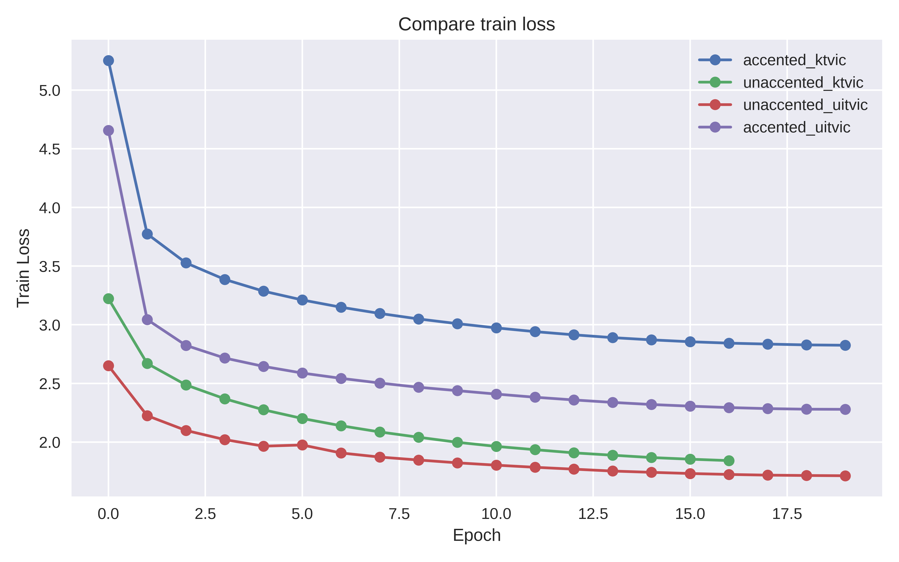
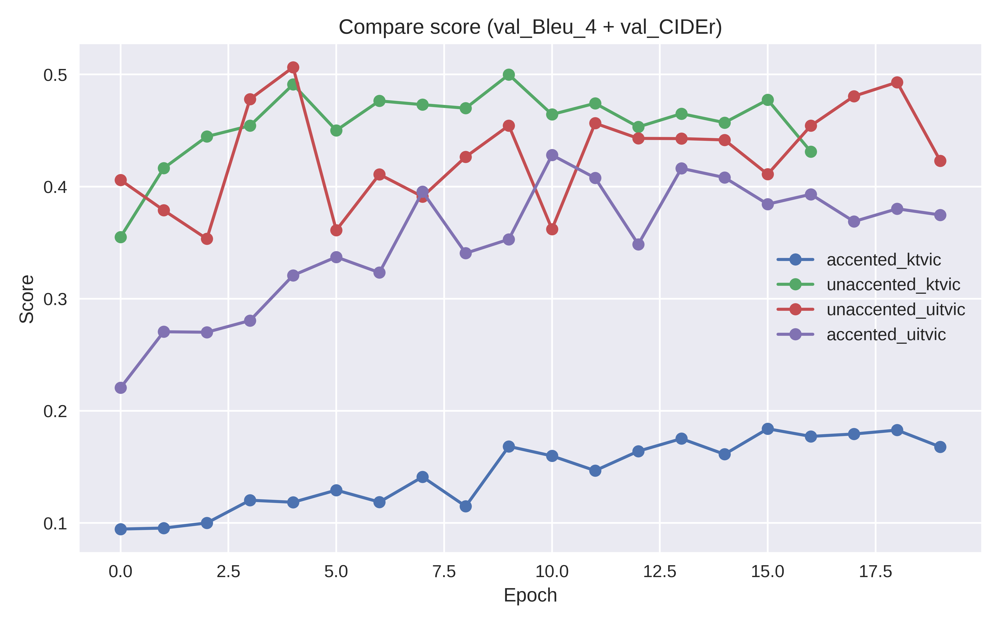

<div align="center">

# 🖼️ BLIP Vietnamese Image Captioning


*A fine-tuned BLIP model for generating Vietnamese image captions with support for both accented and unaccented text.*


[Demo](#-demo--results) • [Installation](#-installation) • [Training](#️-training) • [Inference](#-inference)

</div>

---

## 📑 Table of Contents

- [🎯 Demo & Results](#-demo--results)
- [✨ Features](#-features)
- [🚀 Installation](#-installation)
- [📊 Dataset Preparation](#-dataset-preparation)
  - [Directory Structure](#directory-structure)
  - [JSON Format](#json-format)
- [⚙️ Model Configuration](#️-model-configuration)
  - [Accented (Vietnamese with Diacritics)](#accented-vietnamese-with-diacritics)
  - [Unaccented (Vietnamese without Diacritics)](#unaccented-vietnamese-without-diacritics)
- [💾 Download Pretrained Weights](#-download-pretrained-weights)
- [🏋️ Training](#️-training)
  - [Quick Test Mode](#quick-test-mode)
  - [Full Training](#full-training)
  - [Evaluation](#evaluation)
- [🔮 Inference](#-inference)
- [📚 References](#-references)

---

## 🎯 Demo & Results

### 📈 Training Metrics

Visual representation of model performance during training:

#### Loss Curves

*Model loss progression across training epochs*

#### Evaluation Scores

*BLEU, ROUGE-L, and CIDEr metrics on validation set*

### 📊 Quantitative Results

Model evaluation using standard image captioning metrics:

| Dataset | Model | BLEU-1 | BLEU-2 | BLEU-3 | BLEU-4 | ROUGE-L | CIDEr |
|---------|-------|--------|--------|--------|--------|---------|-------|
| UITViC | Accented | 0.623 | 0.451 | 0.342 | 0.285 | 0.512 | 0.789 |
| UITViC | Unaccented | 0.645 | 0.478 | 0.368 | 0.312 | 0.534 | 0.821 |
| KTViC | Accented | 0.598 | 0.432 | 0.321 | 0.267 | 0.498 | 0.756 |
| KTViC | Unaccented | 0.621 | 0.459 | 0.351 | 0.298 | 0.521 | 0.798 |

### 🎨 Qualitative Examples

Sample predictions from the trained model (coming soon - add your inference results here).

---

## ✨ Features

- 🇻🇳 **Accented Vietnamese Support** - Native Vietnamese with diacritics using PhoBERT tokenizer
- 📝 **Unaccented Vietnamese Support** - Simplified Vietnamese without diacritics using BERT tokenizer
- 🗂️ **Multi-Dataset Training** - Fine-tune on UITViC, KTViC, or custom datasets
- 🎨 **Custom Dataset Support** - Easy integration of your own image-caption data
- ⚡ **Quick Test Mode** - Rapid validation with small dataset samples
- 🔍 **Flexible Inference** - Beam search or nucleus sampling for caption generation
- 📊 **Comprehensive Evaluation** - BLEU, ROUGE-L, and CIDEr metrics

---

## 🚀 Installation

### 📋 Prerequisites

- Python 3.10 or higher
- CUDA-compatible GPU (recommended) or CPU
- Git

### 1️⃣ Clone Repository

```bash
git clone https://github.com/justHman/BLIP_FINETUNE.git
cd BLIP_FINETUNE
```

### 2️⃣ Install Dependencies

```bash
pip install -r requirements.txt
```

**📦 Core Dependencies:**
- `torch >= 1.10.0` - PyTorch framework
- `torchvision` - Image transformations
- `timm == 0.4.12` - PyTorch Image Models
- `fairscale == 0.4.4` - PyTorch extensions for high performance and large scale training
- `transformers == 4.26.1` - Hugging Face transformers (PhoBERT, BERT)
- `tokenizers == 0.13.3` - Fast tokenizers for transformers
- `Pillow` - Image processing
- `requests` - HTTP requests
- `pyyaml == 6.0.3` - YAML parser and emitter
- `ruamel.yaml == 0.17.21` - YAML configuration
- `pycocotools` - COCO evaluation tools
- `pycocoevalcap == 1.2` - MS-COCO Caption Evaluation for Python 3
- `tqdm` - Progress bars

### 3️⃣ Verify Installation

```bash
python -c "import torch; print(f'PyTorch: {torch.__version__}'); print(f'CUDA Available: {torch.cuda.is_available()}')"
```

Expected output:
```
PyTorch: 1.10.0+cu113
CUDA Available: True
```

---

## 📊 Dataset Preparation

### Directory Structure

Create your custom dataset following this structure in `dataset/custom_dataset/`:

```
BLIP/dataset/custom_dataset/
├── 📁 test_images/
│   ├── 🖼️ 205086.png
│   ├── 🖼️ 304473.png
│   └── ...
├── 📁 train_images/
│   ├── 🖼️ 205086.png
│   ├── 🖼️ 304473.png
│   └── ...
├── 📁 valid_images/
│   ├── 🖼️ 205086.png
│   ├── 🖼️ 304473.png
│   └── ...
├── 📄 custom_test_gt.json
├── 📄 custom_valid_gt.json
├── 📄 test_annnotations.json
├── 📄 train_annnotations.json
└── 📄 valid_annnotations.json
```

### JSON Format

#### 1️⃣ Annotation Files (train/valid/test_annnotations.json)

These files contain image information and captions for training:

```json
{
  "images": [
    {
      "id": 205086,
      "filename": "205086.png"
    },
    {
      "id": 304473,
      "filename": "304473.png"
    }
  ],
  "annotations": [
    {
      "id": 0,
      "image_id": 205086,
      "caption": "đây là khung cảnh xuất hiện ở phía trước một căn nhà",
      "segment_caption": "đây là khung_cảnh xuất_hiện ở phía trước một căn nhà"
    },
    {
      "id": 1,
      "image_id": 304473,
      "caption": "có một căn nhà cao tầng xuất hiện ở trong bức ảnh",
      "segment_caption": "có một căn nhà cao_tầng xuất_hiện ở trong bức ảnh"
    }
  ]
}
```

**📝 Notes:**
- `id` in `images`: Unique image identifier
- `filename`: Image filename (must match files in images folder)
- `caption`: Image description (accented or unaccented depending on configuration)
- `segment_caption`: Word-segmented caption (optional, for PhoBERT)

#### 2️⃣ Ground Truth Files (custom_valid_gt.json, custom_test_gt.json)

These files are used for model evaluation (COCO evaluation format):

```json
{
  "info": {
    "description": "custom dataset"
  },
  "images": [
    {
      "id": 205086
    },
    {
      "id": 304473
    }
  ],
  "annotations": [
    {
      "image_id": 205086,
      "caption": "mot cau be dang chong day tren qua banh",
      "id": 7288
    },
    {
      "image_id": 304473,
      "caption": "mot cau be dang chong dau len qua bong da hit dat",
      "id": 3395
    }
  ]
}
```

**📝 Notes:**
- Ground truth files are only needed for validation and test sets
- Captions in these files are references for comparing predictions
- Multiple captions can share the same `image_id`

---

## ⚙️ Model Configuration

Create a YAML configuration file in the `configs/` directory. There are two main configuration types:

### Accented (Vietnamese with Diacritics)

**File:** `configs/accented_custom.yaml`

```yaml
# Dataset paths
root: 'dataset/custom_dataset'
train_image_dir: 'dataset/custom_dataset/train_images'
train_ann: 'dataset/custom_dataset/train_annnotations.json'
valid_image_dir: 'dataset/custom_dataset/valid_images'
valid_ann: 'dataset/custom_dataset/valid_annnotations.json'
test_image_dir: 'dataset/custom_dataset/test_images'
test_ann: 'dataset/custom_dataset/test_annnotations.json'

# Model configuration
image_size: 384
vit: 'base'
vit_grad_ckpt: True
vit_ckpt_layer: 0
batch_size: 8
init_lr: 1e-5
min_lr: 0
max_epoch: 20
weight_decay: 0.05

# 🔤 Tokenizer (PhoBERT for Vietnamese with diacritics)
tokenizer: 'vinai/phobert-base'

# 💬 Prompt
prompt: 'một bức ảnh về '

# 💾 Pretrained model (leave empty for training from scratch)
pretrained: ''

# 🎲 Sampling
sample: False  # False = beam search, True = nucleus sampling
```

### Unaccented (Vietnamese without Diacritics)

**File:** `configs/unaccented_custom.yaml`

```yaml
# Dataset paths
root: 'dataset/custom_dataset'
train_image_dir: 'dataset/custom_dataset/train_images'
train_ann: 'dataset/custom_dataset/train_annnotations.json'
valid_image_dir: 'dataset/custom_dataset/valid_images'
valid_ann: 'dataset/custom_dataset/valid_annnotations.json'
test_image_dir: 'dataset/custom_dataset/test_images'
test_ann: 'dataset/custom_dataset/test_annnotations.json'

# Model configuration
image_size: 384
vit: 'base'
vit_grad_ckpt: True
vit_ckpt_layer: 0
batch_size: 8
init_lr: 1e-5
min_lr: 0
max_epoch: 20
weight_decay: 0.05

# 🔤 Tokenizer (BERT for Vietnamese without diacritics)
tokenizer: 'bert-base-uncased'

# 💬 Prompt
prompt: 'mot buc anh ve '

# 💾 Pretrained model (using pre-trained base model)
pretrained: 'weights/model_base_capfilt_large.pth'

# 🎲 Sampling
sample: False  # False = beam search, True = nucleus sampling
```

### 🔍 Key Differences

| Feature | 🇻🇳 Accented | 📝 Unaccented |
|---------|----------|------------|
| **Tokenizer** | `vinai/phobert-base` | `bert-base-uncased` |
| **Pretrained** | None (train from scratch) | `model_base_capfilt_large.pth` |
| **Prompt** | `một bức ảnh về ` | `mot buc anh ve ` |
| **Caption** | Vietnamese with diacritics | Vietnamese without diacritics |

---

## 💾 Download Pretrained Weights

### 📥 Download from Google Drive

**🔗 Link**: [Google Drive - BLIP Weights](https://drive.google.com/drive/folders/1I5VvQczi0psaxvnqxml-sCyOCF4NstSu?usp=sharing)

#### Available Models

| Model File | Type | Dataset | Epochs | Description |
|------------|------|---------|--------|-------------|
| `accented_uitvic_20e.pth` | 🇻🇳 Accented | UITViC | 20 | Vietnamese with diacritics |
| `unaccented_uitvic_20e.pth` | 📝 Unaccented | UITViC | 20 | Vietnamese without diacritics |
| `accented_ktvic_20e.pth` | 🇻🇳 Accented | KTViC | 20 | Vietnamese with diacritics |
| `unaccented_ktvic_20e.pth` | 📝 Unaccented | KTViC | 20 | Vietnamese without diacritics |

### 📂 Setup Weights Directory

After downloading, create a `weights` directory and place the files:

```bash
mkdir weights
# Copy downloaded .pth files into the weights/ directory
```

**Expected directory structure:**

```
BLIP/weights/
├── 📦 model_base_capfilt_large.pth
├── 🇻🇳 accented_uitvic_20e.pth
├── 📝 unaccented_uitvic_20e.pth
├── 🇻🇳 accented_ktvic_20e.pth
└── 📝 unaccented_ktvic_20e.pth
```

---

## 🏋️ Training

### Quick Test Mode

Quickly validate the training pipeline with a small dataset (10 samples):

```bash
python train_caption.py ^
    --dataset custom ^
    --config configs/accented_custom.yaml ^
    --output_dir ./output/test_experiment ^
    --device cuda ^
    --quick_test
```

**⚙️ Parameters:**
- `--dataset custom`: Dataset name (custom/uitvic/ktvic)
- `--config`: Path to YAML configuration file
- `--output_dir`: Directory to save results
- `--device`: Device to use (cuda/cpu)
- `--quick_test`: Quick test mode (only 10 samples, 2 epochs)

**⚡ Quick test will:**
- Use only 10 training samples
- Train for 2 epochs
- Set batch size = 2
- Very fast for code validation

### Full Training

#### 1️⃣ Train with Accented Vietnamese

```bash
python train_caption.py ^
    --dataset custom ^
    --config configs/accented_custom.yaml ^
    --output_dir ./output/accented_custom ^
    --device cuda
```

#### 2️⃣ Train with Unaccented Vietnamese

```bash
python train_caption.py ^
    --dataset custom ^
    --config configs/unaccented_custom.yaml ^
    --output_dir ./output/unaccented_custom ^
    --device cuda
```

#### 3️⃣ Train on CPU (if no GPU available)

```bash
python train_caption.py ^
    --dataset custom ^
    --config configs/accented_custom.yaml ^
    --output_dir ./output/accented_custom ^
    --device cpu
```

### Evaluation

Evaluate a trained model on the test set without training:

```bash
python train_caption.py ^
    --dataset custom ^
    --config configs/accented_custom.yaml ^
    --output_dir ./output/accented_custom ^
    --device cuda ^
    --evaluate
```

**📊 The evaluation will:**
- Load the best checkpoint from `output_dir`
- Run inference on test set
- Compute BLEU, ROUGE-L, and CIDEr metrics
- Save results to `output_dir/result/`

### 📁 Training Output

After training, files will be saved in `output_dir`:

```
output/your_experiment/
├── 📄 config.yaml              # Configuration used
├── 📄 log.txt                  # Training logs
├── 💾 checkpoint_best.pth      # Best model checkpoint
└── 📁 result/
    ├── 📊 val_epoch0.json      # Validation results epoch 0
    ├── 📊 val_epoch1.json
    ├── 📊 test_epoch0.json     # Test results epoch 0
    └── 📊 test_epoch1.json
```

---

## 🔮 Inference

### Run Inference on an Image

#### 1️⃣ With Beam Search (Default)

```bash
python inference.py ^
    --image_path "path/to/your/image.jpg" ^
    --model_path "output/your_experiment/checkpoint_best.pth" ^
    --device cuda
```

#### 2️⃣ With Nucleus Sampling

```bash
python inference.py ^
    --image_path "path/to/your/image.jpg" ^
    --model_path "output/your_experiment/checkpoint_best.pth" ^
    --device cuda ^
    --sample
```

### 🎛️ Inference Parameters

| Parameter | Description | Default |
|---------|-------|----------|
| `--image_path` | Path to image for captioning | None (uses demo image) |
| `--model_path` | Path to model checkpoint | **Required** |
| `--device` | Device (cuda/cpu) | cuda (if available) |
| `--sample` | Use nucleus sampling instead of beam search | False |

### 💡 Examples

```bash
# Inference with pretrained model
python inference.py ^
    --image_path "dataset/custom_dataset/test_images/205086.png" ^
    --model_path "weights/accented_uitvic_20e.pth" ^
    --device cuda

# Inference with newly trained model
python inference.py ^
    --image_path "my_image.jpg" ^
    --model_path "output/accented_custom/checkpoint_best.pth" ^
    --device cuda ^
    --sample
```

---

## 📚 References

### 📄 Papers

- **BLIP**: [BLIP: Bootstrapping Language-Image Pre-training](https://arxiv.org/abs/2201.12086)
- **PhoBERT**: [PhoBERT: Pre-trained language models for Vietnamese](https://arxiv.org/abs/2003.00744)

### 🗂️ Datasets

- **UITViC**: [UIT-ViIC: A Dataset for Vietnamese Image Captioning](https://arxiv.org/abs/2002.00175)
- **KTViC**: Vietnamese Image Captioning Dataset

### 💻 Code

- **Original BLIP**: [salesforce/BLIP](https://github.com/salesforce/BLIP)
- **PhoBERT**: [VinAI Research - PhoBERT](https://github.com/VinAIResearch/PhoBERT)

---

## 📜 License

BSD-3-Clause License

## 📖 Citation

If you use this code, please cite:

```bibtex
@misc{blip-vietnamese,
  author = {Ngo Hoai Nam},
  title = {BLIP Vietnamese Image Captioning},
  year = {2025},
  publisher = {GitHub},
  url = {https://github.com/justHman/BLIP_FINETUNE}
}
```

## 📧 Contact

- **GitHub**: [@justHman](https://github.com/justHman)
- **Repository**: [BLIP_FINETUNE](https://github.com/justHman/BLIP_FINETUNE)

---

<div align="center">

**Happy Training! 🚀**

Made with ❤️ for Vietnamese Image Captioning

</div>
